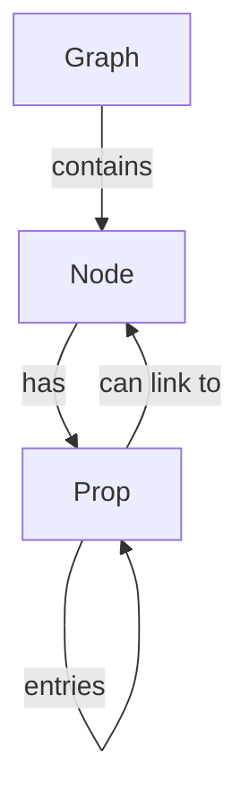
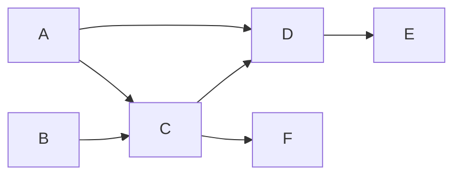

# Design Document

_Graphs_ are an inherent part of the visual programming paradigm. They are used to perform computations on data.

Graphs consist of a series of interconnected _nodes_ — atomic units of computation that take some data via _properties_, perform a computation and return a result. The result of one node can be linked to the properties of other nodes. By combining various nodes one can build an arbitrarily complex data transformation pipeline.

The following principles are essential to the user experience of visual programming with graphs:

- **Instant feedback** — nodes are immediately evaluated and the intermediate results are displayed; this allows for "creative scripting" flow where you don't necessarily know what you want to achieve and how, but can figure something out on the go with data guiding the thought process.
- **Composability** — being able to combine multiple nodes together define the language capability.
- **Atomicity** — a key prerequisite to composability, each node should aim to "do one thing and do it good".
- **Reusability** — any part of graph can be extracted into a standalone "function graph" and can subsequently be used in other graphs. This allows users to define their own toolkits and libraries and further scale the language in the direction of user choice.

## Model

A high-level overview of a Graph model:

- Graph consists of one or more nodes.
- Each node is linked to its definition using `ref` field.
- Node definition determines:
  - what the node looks like in the editor
  - which properties it supports
  - what is the data type of each property
  - what is the result type of the node
  - how to compute the result, given the parameters
- Each node has properties that describe how a particular node instance is configured (e.g. whether or not the property is linked to the result of another node).
- Each property may have additional sub-properties called "entries". Entries can be used to create dynamic objects and arrays.



Note: each node result can be linked to multiple nodes, or to the multiple properties of the same node; however, each property can only have one link (multiple results cannot be plugged into the same property)

## Node Definitions

Graphs are compiled into *definitions* — ESM modules with `export const node: NodeDef<Param, Returns> = { ... }`.

A definition module can also be written in TypeScript or JavaScript, for example:

```ts
import { Operator } from '../../main/types/defs.js';

export const node: Operator<{
    a: number;
    b: number;
}, number> = {
    metadata: {
        label: 'Math.Add',
        description: 'Computes a sum of two numbers.',
        params: {
            a: {
                schema: {
                    type: 'number'
                }
            },
            b: {
                schema: {
                    type: 'number'
                }
            }
        },
        result: {
            type: 'number',
        },
    },
    compute(params) {
        return params.a + params.b;
    }
};
```

Graph Compiler would take a Graph and compile it into a definition module that can be imported as a dependency in other graphs. Therefore, the composability is achieved by being able to extract common functions as separate graphs that can be used elsewhere.

## Dependency resolution

Each node must have a corresponding node definition so that it can be computed and rendered by the editor. Nodes reference their corresponding node definitions via `ref` field.

Each graph maps refs to URLs where to load the definition modules from. Such map is maintained in the `refs` object.

```yaml
graph:
  nodes:
    - ref: object
      props:
        # ...
    - ref: foo
      props:
        # ...
  refs:
    object: https://nodescript.land/-/stdlib/object.js?v=1.2.3
    foo: https://unpkg.com/my-awesome-module/foo-node.js
```

In this example `object` ref resolves to `https://nodescript.land/-/stdlib/object.js?v=1.2.3`.

You can think of `ref` as a graph-local variable name, its only purpose is to avoid duplicating URLs when the same definition is used a lot.

## Runtime Requirements

Runtime environment must support ESM and importing modules from `https://`.

- Modern browsers support this natively.
- Deno supports this out of box.
- In Node.js 18+ it is possible with `--experimental-network-imports` flag.
- In Node < 18 it is possible to implement a custom module resolution hook.
- Environments that do not support ESM are generally not supported, although it may be possible to bundle/transpile the compiled graph with tools like Webpack or ESBuild.

## Computation Order

Graphs are generally executed right-to-left. Consider the following example:



To compute `E` we need to compute `D`, for that we need `A` and `C` which in turn needs `B` and `A` (which should already be computed). `F` is not required to compute `E` (we refer to such nodes as dangling).

## Array expansion

One of the cool features of graph computation model is the ability to automatically apply the same node to multiple elements and then accumulate the result into an array.

It's really easy to understand how it works by just playing with the graph editor.

The detailed explanation is as follows:

- Array expansion is activated per each property.
- If any of the node properties is expanded, the node is considered expanded (i.e. applied multiple times) and its result will always be an array.
- Each expanded property is evaluated and, if necessary, converted into an array.
- On every iteration the compiler takes the next element of each expanded property and feed it into the node's `compute` function alongside non-expanded properties.
- The iterations stop after any of the expanded arrays is exhausted. Thus the result length is the minimum of all expanded arrays.

## Type conversion

Node definitions define the types of parameters and return values using `schema` field. Compiler makes sure that all parameters are cast to the appropriate types by checking the schema compatibility of `params` and `returns` of corresponding node definitions. This allows complier to avoid emitting unnecessary type casting code, but it heavily relies on proper type declarations on node definitions.

A special `type: any` (not part of JSON schema standard) is used to describe unknown types. Type conversion never occurs when the desired schema is `type: 'any'`, but always occurs when the source schema is `type: 'any'` and the target schema is anything else.
