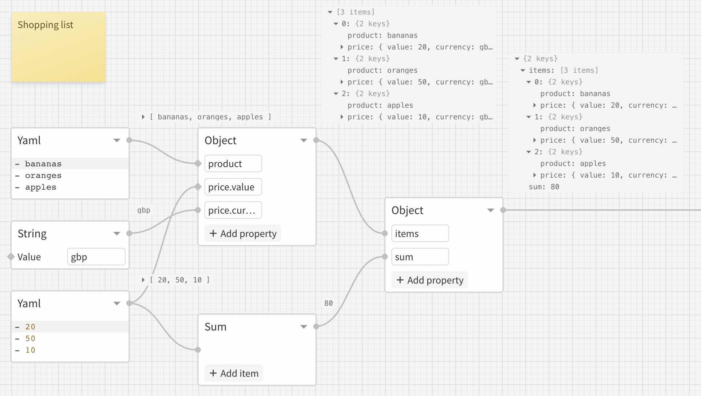

# NodeScript

**Status: active development, breaking changes may occure in minor 0.x.x releases.**

Visual programming language for the modern Web.

- Powerful & intuitive
- Works in Browsers and Node
- Compiles into JavaScript (ESM)

## Core concepts

NodeScript employs [directed acyclic graphs](https://en.wikipedia.org/wiki/Directed_acyclic_graph) (DAG) as its main computation model.

Graphs are composed with nodes — atomics units of computations that can be linked together. Nodes are evaluated instantly, allowing one to immediately observe the results and reason about the data.

Learn more in [the design document](./DESIGN.md).
